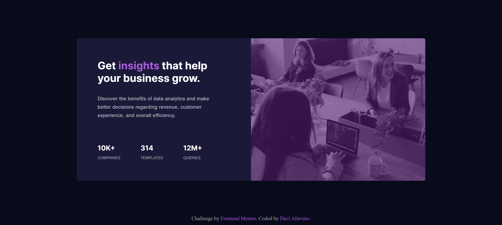
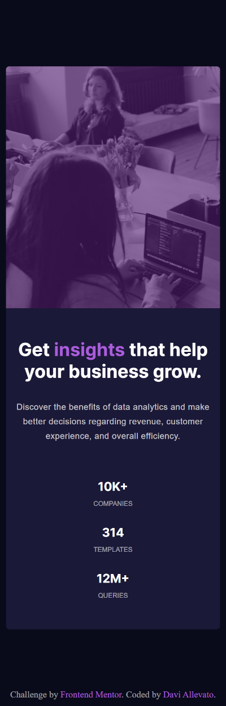

# Frontend Mentor - Stats preview card component

Esta é uma solução para o [Stats preview card component](https://www.frontendmentor.io/challenges/stats-preview-card-component-8JqbgoU62/hub/stats-preview-card-component-Dbj83bpyQ). Os desafios do Frontend Mentor ajudam você a melhorar suas habilidades de codificação criando projetos realistas.

## Índice

- [Visão geral](#visão-geral)
  - [O desafio](#O-desafio)
  - [Screenshot](#Screenshot)
  - [Links](#links)
- [Meu processo](#Meu-processo)
  - [Construído com](#Construído-com)
- [Autor](#autor)

## Visão geral

### O desafio

Os usuários devem ser capazes de:

- Visualize o layout ideal dependendo do tamanho da tela do dispositivo
- Veja os estados de foco para elementos interativos

### Screenshot

**Desktop Screenshot**

**Tablet Screenshot**

**Mobile Screenshot**

### Links

- URL da solução: 

- URL do site ao vivo: 

## Meu processo

### Construído com

- Semantic HTML5 markup
- CSS custom properties
- Flexbox

## Autor

- Frontend Mentor - 

- GitHub - 

